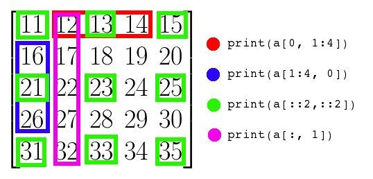

#### NumPy

Numerical + Python

###### NumPy常用的任务：

- 机器学习：各种矩阵运算
- 图像处理和计算图形学：多维数字数组处理
- 数学计算：数值积分、微分、内插、外推等


```python
import numpy as np
```

**创建数组**

```python
np.array([1,2,3,4], dtype = np.int8)
np.array((1,2,3,4), dtype = np.int8)
np.arange(5)   #[0,1,2,3,4]
np.linspace(0, 5, num = 3)  #[0, 2.5, 5]
np.random.random(5)  #5个0~1的随机数组成的一维数组
np.zeros((2,3), dtype = np.int8)
np.ones((2,3), dtype = np.int8)
np.eye(2)  #array([[1.,0.],[0.,1.])
np.full((2,2), 5, dtype = np.int8)  #array([[5,5],[5,5]])
```


**查看数组信息**

```python
a = np.array([1,2,3,4], dtype = int8)
a.shape     #np.shape(a)
a.dtype     #a中元素的数据类型
'''
如果使用a.dtype = ... 重新改变已定义好的a的数据类型，需要注意的是内存中并不会改变
数组a所使用的内存大小。所以如果将a的数据类型变小，则会按照倍数将a的数据个数增加，比如从
np.int16转为np.int8,原来a中的每个数据都会拆分为2个。如果将a中单个元素的内存变大，则需要
能整除a总字节，比如从np.int8到np.int16,需要有偶数个数据才可以，这样原来每两个元素就被合
并为了一个元素。
'''
a.size      #a中元素个数
a.itemsize  #每个元素所占字节数
a.ndim      #a的维数
a.nbytes    #a中所有元素所占的字节数
```

**数组运算**

```python
a = np.array([[1.0, 2.0], [3.0, 4.0]]) 
b = np.array([[5.0, 6.0], [7.0, 8.0]]) 
a + b 
a - b 
a * b   #(逐元素相乘)
a.dot(b)  #矩阵乘法
a / b
a ** 2  

a = arange(1,10)
a = a.reshape(3,3)  
'''
a = array([[1, 2, 3],
       [4, 5, 6],
       [7, 8, 9]])
'''
a.max()    #9
a.min()    #1
a.sum()    #45
a.cumsum()   #逐元素累积加和，array([ 1,  3,  6, 10, 15, 21, 28, 36, 45])  

np.sin(a)
np.cos(a)
np.sqrt(a)
```

**数组索引**



```python
::n #从0索引开始，每n个取1个
a = np.arange(1,10)
a = a.reshape(3,3)   #a = array([[1,2,3],[4,5,6],[7,8,9]])
mask = a & 1 == 0 #取a中偶数的mask
a[mask]  #array([2, 4, 6, 8])
a[1]  #array([4, 5, 6])
index = np.where(a > 3)   #(array([1, 1, 1, 2, 2, 2]), array([0, 1, 2, 0, 1, 2]))
a[index]   #array([4, 5, 6, 7, 8, 9])
```

